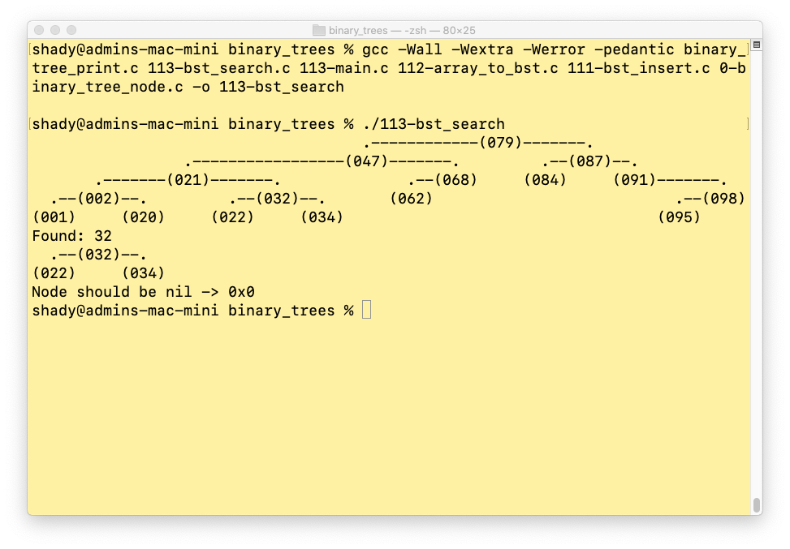

## Binary Tree project

### task 0

[0-node](README.md) 

### task 1

[1-left](README.md) 

### task 2

[2-right](README.md) 

### task 3

[3-del](README.md) 

### task 4

[4-leaf](README.md) 

### task 5

[5-root](README.md) 

### task 6

[6-pre](README.md) 

### task 7

[7-in](README.md) 

### task 8

[8-post](README.md) 

### task 9

[9-height](README.md) 

### task 10

[10-depth](README.md) 

### task 11

[11-size](README.md) 

### task 12

[12-leaves](README.md) 

### task 13

[13-nodes](README.md) 

### task 14

[14-balance](README.md) 

### task 15

[15-full](README.md) 

### task 16

[16-perfect](README.md) 

### task 17

[17-sibling](README.md) 

### task 18

[18-uncle](README.md) 

### task 100

[100-ancestor](README.md) 

### task 101

[101-lvl](README.md) 

### task 102

[102-complete](README.md) 

### task 103

[103-rotl](README.md) 

### task 104

[104-rotr](README.md) 

### task 110

[110](README.md) 

### task 111

[111](README.md) 

### task 112

[112](README.md) 

### task 113

[113](README.md) 

### task 114

[114](README.md) 

### task 120

[120](README.md) 

### task 121

[121](README.md) 